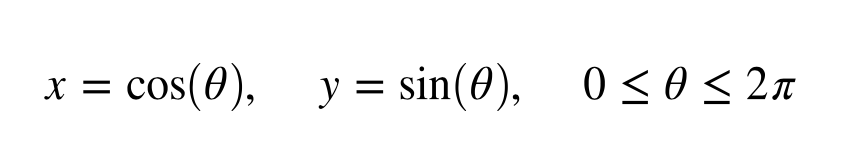

# Debug Plotting 1

The equation for a circle (x,y) is given by

The code is an attempt to plot the circle. Run the code to view any errors, and see the resulting plot. Then amend the code so that it

1. Plots the circle in a black solid line
2. labels the x-axis 'x', the y-axis 'y'

