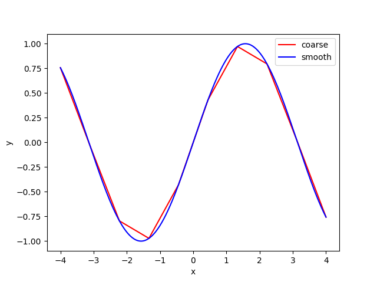

# Debug Plotting 1

The code is supposed to plot the function sin(x) for different numbers of grid points between -4 and 4.

The function is evaluated for 10 points between -4 and 4, and then for 500 points between -4 and 4. Hence when we plot it we should see one 'coarse' function and one 'smooth' function.

Fix the code so that produces a plot that looks like this:

Ensure that the coarse function is plotted in red and the smooth function in blue.
