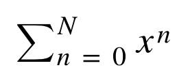

# For loops 2: geometric series

Create a function named `sum_geometric` which evaluates the geometric series



for some given values of _x_ and _N_. Please note the difference between _n_ and _N_: _n_ is a dummy variable that designates the index of the summation (and thereby the power of _x_) and _N_ is the upper limit on the value of _n_.

The function should return the value of the geometric series as calculated with those inputs

E.G. 

```
print (sum_geometric(0.5,4))  
```

should print

```
1.9375
```

I.E 

```
1 + 0.5 + 0.25 + 0.125 + 0.0625
```

To do this 

1. Define the function with the required input variables (`x` and `N`)
2. Define a variable `running_total` and set its value to zero
3. Set up a loop which will run over the required values of the variable `n`
4. Within the loop, calculate the value of a variable (call it '`term`') which is the value of the term in the geometric series (i.e. 'x to the n')
5. Add `term` onto the `running_total`: i.e. `running_total` should be set equal to `running_total` + `term`
6. Outside the loop, return the value of the `running_total`.


