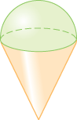

# Functions

1. Define a function which, when provided with the radius of a hemisphere, returns the volume. The function should be named `hemi_volume`
&nbsp;

2. Define a function which, when provided with the radius and height of a cone, returns the volume. The function should be named `cone_volume`
&nbsp;

3. Imagine a compound object which is composed of a cone and a hemisphere like this

- Define a function which, when provided with the radius and height of the cone, returns the volume of the compound object. The function should be named `compound_volume`. 

- Best practice should avoid duplicate code. So instead of simply using the equations for the cone and hemisphere again, use the functions `hemi_volume` and `cone_volume`, that you've already defined

