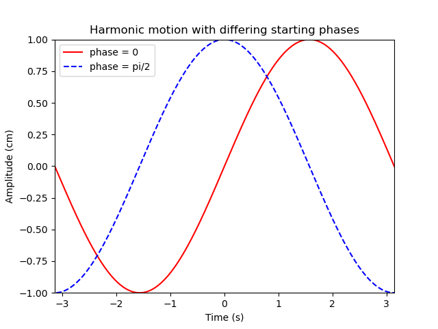

# Plotting 

The data sets to be ploted have been defined for you: don't edit them!

1. Plot the values of y against x using a solid red line
2. Plot the values of z against x using a dashed blue line
3. Label the x-axis 'Time (s)' and the y-axis 'Amplitude (cm)' 
4. Give the chart the title "Harmonic motion with differing starting phases".
5. Include a legend labelling the lines "phase = 0" and "phase = pi/2" as appropriate.
6. Set the limits on the axes such that we have 

Save the figure with the filename "waves.png" using the plt.savefig command. 

The figure should look like this:

