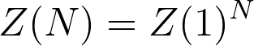

# The analytic derivations

The method that I showed you in the last exercise for calculating the ensemble average for the energy as a function of temperature will (in theory) work for any system where each the individual particles can adopt one of a finite number of M distinct states.  In other words, this method will work for both interacting and non-interacting particles.  It is important to note, however, that using it is not really feasible when the number of particles in the system, N, is large.

In some special cases we can also calculate an anlytic expression that gives the partition function in terms of the magnetic field strength H, the number of spins and the temperature T.  Deriving these expressions is certainly possibly for the non-interacting particles that you are studying in this exercise.  In this exercise, I am thus going to show you how we can use SymPy to calculate the partition function and the ensemble average for the energy analytically for these non-intracting systems.  

The first thing you need to recognise when deriving these analytic expression is that if the particles are on a lattice and if they do not interact we can determine the N-particle partition function Z(N) from the one particle partition function Z(1) as follows:

The one particle partition function is easy to calculate as it is simply:

where the sum runs over all the M states the individual particles can be within and where E_i is the energy of the ith state the particle can be within.  Hence, for systems with the Hamiltonian that we have been studying in these exercises:

where the individual particles can be in state s_n = -1 or s_n = +1 the one particle partition function is thus:

so the N particle partition function is;

Once we have an analytic expression for the partition function for our system such as the one above we can easily calculate all thermodynmaic averages.  For example, we can calculate the ensemble average of the energy as a function of temperature from the function aboveusing:

 

In the `main.py` file I have provided for this exercise, I have used Sympy and the expressions above to derive an analytic expression for the ensemble average of the energy as a function of temperature.  As you can see, Sympy can compute the partial derivaties that I need directly.  I can thus avoid doing tedious derivations using pen and paper (or I can use Sympy to check that I got the correct results from my tedious derivatives).  

The derivation that I have done is for the Hamiltonian that I have written in the third of the equations above.  I would like you to modify the `main.py` file and to derive an analytic expression for the ensemble average of the energy for a system of non-interacting particles that can each occupy three distinct states that have energies of 0, 1 and 3 units.

At the end of my `main.py` file I have used NumPy and Matplotlib to draw a graph showing the analytic function for the ensemble average of the energy as a function of temperature.  To pass this exercise you will need to use the expression you derived using Sympy to redraw this graph.  You will pass once you have a graph that shows how the ensemble average of the energy for a system with 8 particles that can each be in the three states described above changes with temperature.
