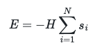
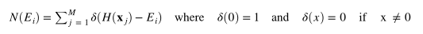
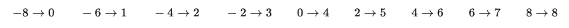

# The density of states I

What you should have seen in the previous exercise was that a system of 8 Ising spins the energy can only take one of nine possible values; namely, -8, -6, -4, -2, 0, 2, 4, 6 and 8.  Rather than plotting the energies of all the states it might therefore be useful to plot the number of microstates that have an energy of -8, the number of microstates that have an energy of -6, the number of microstates that have an energy of -4, the number of microstates that have an energy of -2 and so on as we are going to learn to do in this exercise.  In other words, what we are going to calculate is a histogram showing the number of microstates that have each of the possible values for the energy.  The graph that we will draw is the density of states.

We are once again going to use the following Hamiltonian



with N=8 and H=1.

In addition, to writing the code to calculate this Hamiltonian you will, once again, need to write a loop over all the possible microstates.  Within this loop you are going to calculate the energy of each microstate E by using your hamiltonian function.  You will then want to use the list called `number_of_microstates` to record the number of microstates that have each of nine the possible energy values in the list called energies.  

Notice that we can express the ith element of `number_of_microstates` as:



where E_i is the ith element of energies.  When the formula for the elements of `number_of_microstates` is written this way it is tempting to think that we need to write 9 if statements that check the value of each energy against the five values in the list called energies. We do not need to do this, however, as the 9 values in energies are evenly spaced.  This fact ensures that there is a formula that maps the values of the energy on to the corresponding index of `number_of_microstates` that we should add one to:

 

Once you have worked out the formula to use to convert the energies on the left of the arrows above above to the indices on the right you will need to convert the real number that is output to an integer by using the Python command:

````
int_number = int( real_number )
````

As with the previous exerise, your Hamiltonian function should work for a system with an arbitrary numbers of spins and an arbitrary magnetic field strength. 
