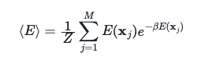

# Ensemble averages

All the textbooks on statistical mechanics will explain to you how, if you have an analytic expression for the partition function, you can extract the ensemble average for the energy.  The problem is that we have not developed an analytic expression by performing these programming exercises.  When we calculated the partition function we instead wrote a program that allowed us to calculate the value of the canonical partition function when the temperature and the magnetic field took on particular values.  In other words, the partition function we have learned to calculate is a single scalar and not an analytic function.  As it is not an analytic function we cannot extract values for the ensemble averages from it.  

We must, therefore, calculate ensemble averages by a different means.  In this exercise we are, therefore, going to learn how to compute the ensemble average of the energy by using the following expression:

In this expression Z is the canonical partition function, which should be evaluated in the way that we learned to calculate it a few exercises previously, \beta is the inverse temperature and the sum runs over the M microstates, x_j, that the system can adopt.  E, meanwhile, is the Hamiltonian.  In this particular exercise we are going to continue using the Hamiltonian that we have used previously:

so each of our individual particles can thus be in one of two states, where they have coordinates of 1 or -1 respectively.  Now, however, because I want you to write a function that takes the number of particles, the magnetic field strength and the temperature as input parameters and that returns the ensemble average for the energy under those conditions, it is essential to write the function `hamiltonian` so that the magnetic field strength `H` can take any value.  

The function that returns the ensble average should be called `ensemble_average`.  This function will return the value of <E> that is calculated using the formula above. Within this function you will thus have a write a sum over all the possible microstates.  Notice, furthermore, that this function takes N (the number of spins), H (the magnetic field strength) and T (the temperature) as its input parameters. 

To compute <E> you will need to compute the energy for each of the microstates that you generate.  In order to make the code more readable I have written a function called `hamiltonian` that takes the microscopic coordinates for all the spins and the magnetic field strength as its input parameters.  This function should calculate the energy for the input microstate using the Hamiltonian given above.   This function will need to be called for each of the microstates that you generate in the function called `ensemble_average`.
