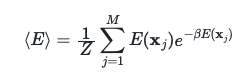

# Understanding changes in the behaviour of the system 

Having learned how to calculate ensemble averages we are now in a position where we can study how the behaviour of the system of spins changes as we change the environmental parameters.  In this exercise, for instance, we are going to look at how the average energy changes as we change the temperature of the system.  

In order to complete this exercise you are going to need to write a program to calculate the ensemble average for the energy once more using this formula:

We are going to continue using the familar Hamiltonian that we have been uing in all these exercises; namely:

so each of our individual particles can thus be in one of two states, where they have coordinates of 1 or -1 respectively.  For this exercise we will look at at a system with H=1 and N=8.  As always though, I expect you to write a 
`hamiltonian` function that can calculate the energy for a system with any number of spins with the field strength set to an arbitrary value.  

You will then need to write a function called `ensemble_average` that loops over all the possible microstates, evaluates their energy and accumulates the quantities that you need to calculate the ensemble averages.  This function will be identical to the function
you wrote in the last exercise. However, at variance with the previous exercise I have written the code that calls your `ensemble_average` function multiple times and that then plots a graph showing the ensemble average of the energy against temperature.

Notice that much like we have done with the `hamiltonian` function in previous exercises I am encouraging to write an `ensemble_average` function that works for all `N`, `H` and `T` values even though this is not strictly necessary to complete the exercises.  Again this is just because it is good to get in the habit of writing these functions in the same way every time.
