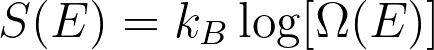

# Entropy as a function of energy

We can calculate the entropy as a function of the energy, S(E), from the density that we have just calculated because the entropy associated with energy E is given by:

Where \Omega(E) is equal to the number of states with energy E.  Your task for this exercise is, therefore, to draw a bar chart that shows the entropy as a function of the energy for a system of 8 particles that can each be in either a +1 or a -1 state.
Once again we will use the following Hamiltonian

with N=8 and H=1.

As in the previous exerise you will need to use the array called `number_of_microstates` to record the number of microstates that have each of nine the possible energy values in the list called energies.  
At variance with the previous exericse, however, you will not plot `eneriges` against `number_of_microstates`.   Instead you are going to use the formula above to calculate the entropy associated with each 
energy, which you will plot on the y-axis.

As with the previous exerise, your Hamiltonian function should work for a system with an arbitrary numbers of spins and an arbitrary magnetic field strength. 
