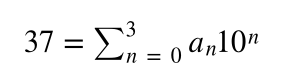
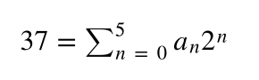

# Converting to binary

In the video I explained how we can enumerate all the states that a system of N non-interacting particles can adopt by using the same ideas that we use for representing numbers.  In these next three exercises I am going to check that you understand these ideas and that you are able to use them to enumerate all the microstates that a system of N particles that can each adopt M states can be in.  

In this first exercise we will consider a system of N particles that can each be in one of two states (0 or 1).  For such systems the state of the N particle system can be stored in a NumPy array that contains only zeros and ones.  This list of ones and zeros can also be converted to a single number if we think of each number as a binary digit.  Your task in these first two exercises is thus to review how we can write algorithms to convert numbers from one representation to another.  This algorithm will prove essential when it comes to enumerating all the microstates that a system can be within.

Lets start by reviewing ideas about the represtation of number that should be familiar. It may sound conterintuitive by the set of symbols 3260 is not actually the number three thousand two hunder and sixty. Instead, it is a representation of that number.  In other words, the four digit number 3260 is actually a set of instructions for constructing a number from simpler parts.  In this case we are being told to construct a number by completing the following set of operations: 

1. First, multiply three by one thousand.
2. Next, multiply two by one hundred.
3. Next, multiply six by ten.
4. Next, multiply one by zero.
5. The number we are interested in is the sum of the four numbers that you obtained from these four multiplications.

We can express these instructions more compactly using the following summation:

where a_0=0, a_1=6, a_2=2 and a_3=3.

The a_n coefficients in this expression are multiplied by powers of ten because we have ten basic symbols for representing numbers 0, 1, 2, 3, 4, 5, 6, 7, 8 and 9.  We do not have a single symbol for representing the numbers eleven or ten so we have to use a pair of symbols to represent these numbers when they are represented in base ten.

We can use a similar idea to express the microstate for our system with N particles that can each be in one of two states using a single number.  As each particle can only be in the zero 0 or 1 state this representation of number does not use base ten as the basic components of the numbers - the states of our particles - cannot be in ten different states.  Each particle can instead only be in two distinct states.  We thus only have two symbols 0 and 1 available to us.  There is no way that the numbers 2 or 3 can be stored using a single particle. 

We thus must understand the coordinates of the microstates as a representation of a number in base 2 rather than base 10.  If the microstate is 100101 then this is a set of instruction that tells us to:

1. First, multiply the number 1 by  32
2. Next, multiply the number 0 by 16
3. Next, multiply the number 0 by 8 
4. Next, multiply the number 1 by 4
5. Next, multiply the number 0 by 2
6. Next, multiply the number 1 by 1
7. The number 100101 is the sum of the six numbers that you obtained from these six multiplications.  In base 10 this is 37

We can express these instructions more compactly using the following summation:
 

where a_0=1, a_1=0, a_2=1, a_3=0, a_4=0 and a_5=1.

__In this exercise, you to use what you have learned by reading the above to complete the function `getBinary`.__  This function should take an integer with a value less than or equal to 63, which we shall call `N` as input.  The function will then return a NumPy array with 6 elements all of which should equal 0 or 1  The zeroth element in this numpy array should be the equivalent of a_0 in the sum above, the second will be a_1 the third a_2 and so on.

At the end of the exercise you should understand the mapping between the microstates a system of N particles that can each be in two states can adopt and the numbers between 0 and 2^N-1 
