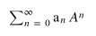

# Generating microstates for systems composed of particles with M<10 states

The last exercise showed you how to convert numbers into their binary representation.  In the next exercise I will show you how this idea is used when we enumerate all the possible microstates for system composed of N particles that can each be in two states.  Before that, however, I want you to generalise the ideas that were introduced in the last exercise by writing a function that returns the base M representation of a number.  You will need this idea when you come to doing your projects as you must study a sytem with particles that can be in three or more distinct states.  

The idea that we are using in this exercise and the last one is that of the base of a number.  In this exercise, we are going to generalise this idea by noting that if each particle has M possible states then each of the microstates for a system of N of these particles can be mapped onto the non-negative integers that are less than M^N symbols using:

where the a_n values tell us which states each of the particles is in.  Your task is to write a function that returns the a_n values in the sum above from the value of the sum.
In other words, to complete this exercise you will need to complete the function `convertToBase`.  This function takes an integer with a value less than or equal to 127, which we will call `N` in input as well as a second integer called `base`, which must be greater than 1 and less than eleven.  Once you have completed it this function should return a numpy array of length 7.   The zeroth element of this array should be the first digit of the base `base` representation of the number, the first element of the array should be the second digit of the base `base` representation of the number and so on.  In other words, the zeroth element in this numpy array should be the equivalent of a_0 in the sum above, the second will be a_1 , the third a_2 and so on.  
