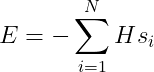

# Hamiltonian for lattice gas system

To progress further with statistical mechanics we need to introduce a Hamiltonian.  We can use this Hamiltonian to determine the energy of a microstate from the microscopic coordinates of the particles that the system is composed of.  

During the next few exercises, we are going to write functions to compute Hamiltonians.  The Hamiltonian functions that we will write will take the list of coordinates as input.  The energy will then be returned, which we will be able to compute as the energy is simply some function of the spin coordinates.

In this exercise we are going to consider a so called lattice gas model in which each spin only interacts with the external magnetic field, H.  Each particle has a coordinate, s_i that is either +1 or -1.  The Hamiltonian is then:

where N is the number of spins and s_i indicates the state of the ith spin (i.e. +1 or -1).

Modify the code in in main.py so that the function called `hamiltonian` calculates the the quantity defined by the formula above.  Notice that this function takes a list called `spins`, which contains all the spin coordinates, as input as well as a scalar variable called `H` that gives the magnetic field strength.
