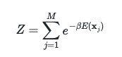

# Calculating the canonical partition function

Now that we know how to generate all the possible microstates for a set of N spins we are in a position where we can finally calculate the canonical partition function using:

Remember that in this expression beta is the inverse temperature and the sum runs over the M microstatesthat the system can adopt.  E, meanwhile, is the Hamiltonian.  For this exercise, we are going to assume that each particle can be in one of two distinct states with coordinates -1 and +1 and that if we have the coordinates of all the particles, s_i, we can evaluate the energy using the following Hamiltonian: 

The sum here run over the number of spins, N.  The Hamiltonian above is often used to describe a set of (non-interacting) nuclear spins that interact with an external magnetic field.  The H parameter in the expression above is, therefore, the magnetic field strength. 

When you fill in the code in `main.py` the function `partitionfunction` should return the value of Z calculated by the formula above.  Within this function you will thus have a write a sum over all the possible microstates.  Notice, furthermore, that this function takes `N` (the number of spins), `H` (the magnetic field strength) and `T` (the temperature) as its input parameters. 

To compute Z you will need to compute the energy for each of the microstates that you generate.  In order to make the code more readable I have written a function called `hamiltonian` that takes the microscopic coordinates for all the spins and the magnetic field strength as its input parameters.  This function should calculate the energy for the input microstate using the Hamiltonian given above.   This function will need to be called for each of the microstates that you generate in the function called `partitionfunction`.
