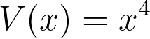
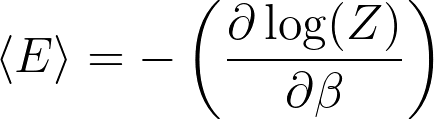
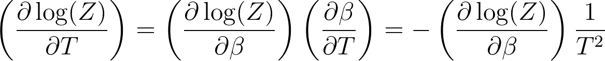

# Analytic derivations for thermodynamic quantities

The exercises you have just completed showed you how to run molecular dynamics simulations of a particle on harmonic potential.  We then learned how to extract thermodynamic quantities from our simulations by calculating ensemble averages.  This exercise is instructive for a harmonic oscillator but not slightly unecessary.  As I have shown you in the videos, we can derive an analytic expression for the partition function of a harmonic oscillator.  There is thus no need to calculate it approximately as we have done here.  The exercises you have completed are not without merit, however, as such derivations are not without merit as for many Hamiltonians of interest such derivations are not possible.

For completeness, I want to show you how we use the mathematical algebra package SymPy to perform the derivations that I did in the video.  In `main.py` I have written code to:

1. Define the hamiltonian function
2. Evaluate the canonical partition function by doing the double integral over the position and momentum coordinates.
3. Differentiate the logarithm of the partition function to extract the ensemble average of the energy

I would like you to extend this code by using SymPy to also calculate the heat capacity.  You should set the variable CV equal to the heat capacity.  To pass the tests you will need to modify `main.py` so that it calculates the heat capacity for the following potential:

The variable CV must be set equal to the heat capacity one particle on a energy landscape with the potential given above.

In the videos I have shown that the ensemble average of the energy is calculated by taking the following derivatives:

The following short derivation should convince you that the derivative above is equivalent to the expression that I have used to calculate the ensemble average of the energy in `main.py`.

Notice that you may be able to use Sympy and the code in `main.py` to calculate the heat capacity for the potential you chose for your assignment.
