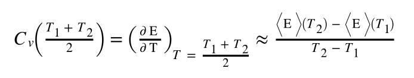
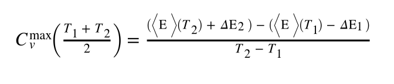
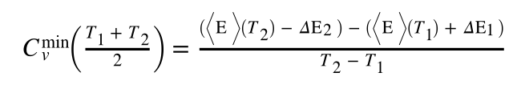
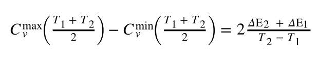
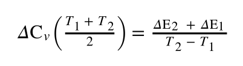

# Heat capacity by finite differences with errors

As you should be keenly aware by now we are not yet done.  The values of the ensemble averages that we used in the formula below:

were estimates as they were computed from MD simulations of finite length.  Consequently, the values that we obtained for the heat capacity were also estimates.  We thus need to compute suitable errors by propagating the errors that were computed for the ensemble averages of the energy.

We can calculate these errors by noting that the maximum possible value we could have computed for the heat capacity is given by: 

where \Delta\E_2 and \Delta\E_1 are the errors for the ensemble averages computed from the simulations at T_2 and T_1 respectively.  This expression is derived by considering the steepest possible gradient that still passes through the two error bars.  Using similar logic, we can consider the shallowest possible gradient that passes through the two error bars and obtain the minimum possible value for the heat capacity as follows:

The difference between these two values gives the range of possible values that the heat capacity might take and is equal to:

This range is symmetric around the value for the heat capacity that is computed using the first formula above, however, so we can thus write our final value for the width of the error bar on the heat capacity as:

To complete this exercise you must, therefore, recompute the heat capacities from the data in the input as you did in the previous exercise.  This time, however, you need to also compute the error bars for the heat capacities that you obtain.  Just in case you have forgotten from the last exercise we import the following lists from `md_data.txt` at the start of the calculation:

* `temperatures` - the temperatures at which the simulations were run
* `energies` - the ensemble average for the total energies at each temperature
* `errror_energies` - the error bars for each of the average energies computed at each temperature.
* `energies2` - the ensemble average for the square of the total energy at each temperature.
* `error_energies2` - the error bars for each of the average squared energies computed at each temperature. 
 
You will calculate the heat capacity at nine different temperatures.  The values of the temperature at which you have computed the heat capacity should be stored in the list called `cv_temperatures` and the final values for the heat capacity should be stored in the list called `cv`.  The errors on the values of the heat capacity should be stored in the list called `cv_errors`.  If you complete the exercise correctly a graph showing the value of the heat capacity as a function of temperature with suitable error bars will be generated. 

N.B.  Please do not change the names of the lists called  `cv_temperatures`, `cv` and `cv_errors`.  If the names of these lists are changed your code will fail the tests.

