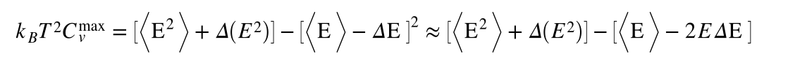
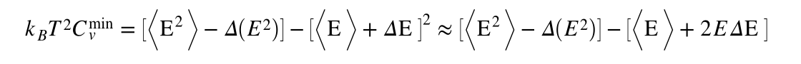
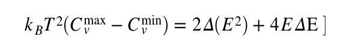
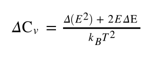

# Heat capacity from fluctuations with errors

As always we are not quite done because we haven't worked out how the error bars for this second method of calculating the heat capacity are determined.  In this exercise, we are thus going to learn how to compute these errors.  We are again going to use the propagation of errors when determining the error on the heat capacity.  We can do this because the first two tasks in this exercise showed us how errors for <E> and <E^2> can be computed using block averaging.  Let's call the errors on these two quantities $\Delta E$ and $\Delta E^2$.  We now note that the heat capacity is a function of <E>and <E^2> and that we can thus calculate the maximum value that this would take using:

Where we have truncated the expansion in the second term here at first order in the error.  Similarly, the minimum value that the heat capacity can take is:

Taking the difference between these two values gives:

And, because this range of values is symmetric around the value for the heat capacity that we computed by inserting the averages we thus arrive at a final value for the error bar of:

To complete this exercise you must, therefore, recompute the heat capacities from the data in the input as you did in the previous exercise.  This time, however, you need to also compute the error bars for the heat capacities that you obtain.  Just in case you have forgotten from the last exercise we import the following lists from `md_data.txt` at the start of the calculation:

* `temperatures` - the temperatures at which the simulations were run
* `energies` - the ensemble average for the total energies at each temperature
* `errror_energies` - the error bars for each of the average energies computed at each temperature.
* `energies2` - the ensemble average for the square of the total energy at each temperature.
* `error_energies2` - the error bars for each of the average squared energies computed at each temperature. 

You will calculate the heat capacity at ten different temperatures.  The values of the temperature at which you have computed the heat capacity should be stored in the list called `cv_temperatures` and the final values for the heat capacity should be stored in the list called `cv`.  The errors on the values of the heat capacity should be stored in the list called `cv_errors`.  If you complete the exercise correctly a graph showing the value of the heat capacity as a function of temperature with suitable error bars will be generated. 

N.B.  Please do not change the names of the lists called  `cv_temperatures`, `cv` and `cv_errors`.  If the names of these lists are changed your code will fail the tests.
