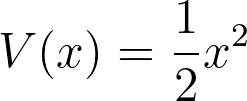

# Calculating the potential 

In the previous set of programming exercises, you learned how we can calculate approximate values for integrals by using a method called Monte Carlo, which works by a set of random microstates and computing an average.  By far the most common way that Monte Carlo simulation is used when doing research in statistical mechanics is through a variant known as molecular dynamics (MD).  In this next set of programming exercises, you are thus going to learn the basics of how to set up and run a molecular dynamics calculation. 

In molecular dynamics calculations configurations are generated by solving Newtons equations numerically.  We are thus not generating random variables except when we set up the intial velocities of the particles.  However, the fact that the intial velocities are set randomly is what generates the randomness.  You can show that small differences in the initial velocities of the particles quickly accumulate.  Trajectories that are started from configurations that are very similar thus quickly diverge.  You can thus treat the observables that emerge from an MD simulation as if they are random variables and analyse any time series that emerge from an MD trajectory as if it is a sequence of random variables.

The first thing you must learn in order to run MD is how to write a function to compute the potential energy for a configuration.  In this set of exercises we are going to learn to run molecular dynamics to investigate the behaviour of a single particle on a potential.  Our system will thus have one position coordinate x and a potential energy V(x) that is calculated as:

Your task in this exercise is to write a function called `potential` that takes the x coordinate of the particle as input and that returns the potential energy by computing the function above.  Easy! 
