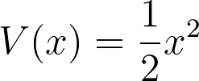

# Calculating the forces

If we were writing a Monte Carlo code we would only need to calculate the potential as the moves are random.  We are writing an MD code, however, so we need to calculate the forces acting on each of the atoms so we can calculate the trajectory.

Writing a program to calculate the forces on the atoms is thus your task in this next exercise.  You must write a function called `potential` that a single scalar, x, as input.  The argument x tells the function the position of the particle on the potential
and thus allows you to calculate V(x) using:

Your function should then return two quantities:

1. A scalar value for the potential.
2. The force that is acting on the particle.

Remember the force is equal to the negative derivative of the potential:

with respect to the atomic positions.  Good luck!

You should try to complete this exercise using the harmonic potential given in the first equation.  However, notice that I test your code by calculating the forces numerically.  The test will thus pass as long as the force the function `potential` returns is the negative derivative of function that was used to calculate the potential.  When doing the assignment for this module you can thus use this repl exercise to test that you have calculated the forces for your selected potential correctly.
