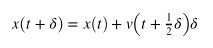
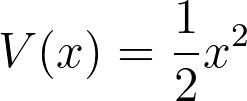

# Generating a trajectory

The fact that we can now calculate the forces means we are in a position to write a molecular dynamics code and to generate our first trajectory.  We are going to be using the velocity Verlet algorithm to solve Newton's equation of motion.  In the code in `main.py` I have set the initial position and velocity of the particle using the variables`init_pos` and `init_vel`.  You can if you wish change the values of these two variables to see what happens when the initial conditions change.  However, these variables only need to be set in one place.  The position and velocity variables that you will use and update when you implement the MD algorithm are called `pos` and `vel`, which you can see are initially set equal to `init_pos` and `init_vel`.

Before we start the main MD loop we first need to calculate the potential the potential energy of the particle in its initial configuration as well as the forces that are acting upon the particle in this configuration.  

Once these steps of initialisation are completed you then need to write a loop that performs the following four steps multiple times.  In this way your trajectory of positions is generated:

1. The velocity, v(t), is updated by a half timestep using:

where F(t) is the force at x(t).

2. The position, x(t), is updated a full timestep using:

3. The force, $F(t+\delta)$, is calculated at the new position.

4. The new values for the forces are used to update the velocities another half-timestep as follows:

Your task is to implement this algorithm in `main.py`.  As in the previous exercise, you need to start by writing a function called `potential` as you did in the previous exercise to calculate the potential and the forces.  This time the potential should be the harmonic potential:

I have written an outline for an MD code that computes a trajectory.  You need to complete this code by implementing the velocity Verlet algorithm that is described above.  You will notice that I use three variables to the position (`pos`), velocity (`vel`) and force (`forces`).  Notice that whenever you update the velocity, position or force in the velocity Verlet algorithm you never again need the old position, velocity or force.  You thus can (and should) use these three variables to hold the instantaneous positions, velocities and forces.  I have written some code that will keep track of the position the particle adopts during the trajectory and that can be used to visualise what has occurred during the calculation.

The final result from your calculation should be a graph that shows how the position of the particle changed during the trajectory.  

N.B Please note the variable timestep, $\delta$, in the algorithm described above should be set to a suitable value.  I have set it to a sensible value in the code to the right.  It is easy to tell if the value of the timestep is not sensible as total energy will not be conserved.      

