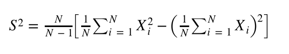
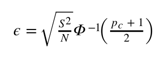

# Error bars II

When we run Monte Carlo (or molecular dynamics) we __always__ need to make sure we quote the error bars.  If a Monte Carlo calculation is performed and no error bars are reported on the final result is not reproducible.  I am emphasizing this now as if you stay in this field, you will see many papers that use Monte Carlo and that do not quote error bars.  Not quoting error bars these error bars a good way of hiding the crappiness of your underlying simulations and getting to a publishable (but dubious) result.  Be warned!

The problem with the resampling scheme that we used to calculate the error bars in the previous exercise is that it is computationally expensive.  It is expensive because we had to compute multiple averages each of which was computed by generating N randomly chosen coordinates.  For the exercise here, where generating each configuration is computationally cheap, this is not a big problem.  If we are doing computationally expensive things for each of the configurations we are generating this sort of resampling scheme is not an option.

In this final exercise, a computationally inexpensive way of computing the error bars will thus be introduced.  This new technique is based on the central limit theorem, which tells us that an average calculated from N random variables (of most types) with expectation a and variance b is (to a good approximation) a sample from a normal distribution with expectation a and variance b/N 

As the final result that we get from a Monte Carlo code is an average computed from multiple random variables we can thus approximate it as a sample from a normal distribution.  Furthermore, we know the exact functional form for the probability density function for the normal distribution so we can use this function when quoting error bars on the calculated mean.

To get you started I have duplicated the function, area, that I gave you in the previous exercise.  This code calculates an estimate for the area of the quarter circle by calculating an average of multiple (Bernoulli) random variables.  You need to modify this function so that it also calculates the variance of these random variables:



Computing this variance is important as this quantity appears in the expression that we derive from the central limit theorem for the error bar.  This expression is:



In this expression, $p_c$ gives the probability that a new estimate for the mean will fall between the mean - $\epsilon$ and the mean + $\epsilon$.  Just as in the previous exercise the error bar is thus telling us something about a range that the data has a certain probability of falling into.

Your task is to modify the function on the right so instead of outputting a single variable it outputs three variables.  The second of these is the average (i.e the same quantity that is currently output by the function).  The first variable is the 5th percentile of the distribution, which should be calculated using the formulas above.  The last variable is the 95th percentile of the distribution.  Again please use the formulas above to calculate this quantity.  Please note that you can calculate the function $\Phi^{-1}$ using the command:

````
ss = st.norm.ppf(0.95)
````
