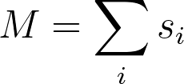
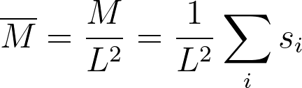
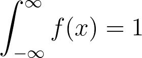

# Calculating a histogram

By now you should be pretty comfortable using Monte Carlo to estimate ensemble averages.  You have seen that to estimate an ensemble average for an observable, A, you simply calculate 
the value of that observable for each microstate that was generated in your Monte Carlo simulation.  You then add all these observations together and divide by the number of observations.
In other words, you calculate the mean for the sample.  Similarly, you have also seen how we can calculate the variance for a sampled observable and how these variances are related to response
functions such as the heat capacity and susceptibility.

In this last batch of exercises I am going to give you some data that has been collected from an Monte Carlo simulation. I am then going to use this data to show you how we can estimate the 
distribution that an observable takes from a Monte Carlo simulation by taking a histogram. We are then going to learn
how to calculate the free energy as a function of our observable and how we can report these free energy surfaces (together with suitable errors) in a paper. 

In `main.py` I have written a command to load the contents of the file `magnetisations` into a numpy array called `mags`.  This file contains the magnetisation values for each of the frames that 
were visited during a short Monte Carlo simulation of a 20x20 2D Lattice of Ising spins.  These magnetisations were calculated using:

where the sum runs over all the spins and the s_i are the spin coordinates.  __Your task is to draw a histogram that gives an estimate of the probablity density as a function of the average magnetisation
per spin__

Your estimate for the probability density should be normalised so:

Furthermore, as the probability density is a continous function, when you draw your graph you should draw a graph with a continuous line showing the estimated distribution with the x-axis label "average magnetisation per spin" and 
y-axis label "probability density".

To estimate the probability density you should construct a histogram with `nbins` bins.  The first of these bins should start at `minx` and the last of them should end at `maxx`.  The estimate for the pdf that you get from each 
of the bins in your histogram should be plotted at the midpoint of the bin.
