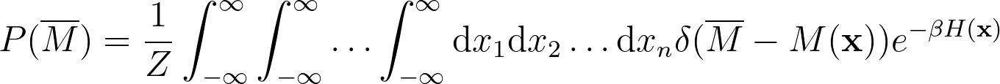
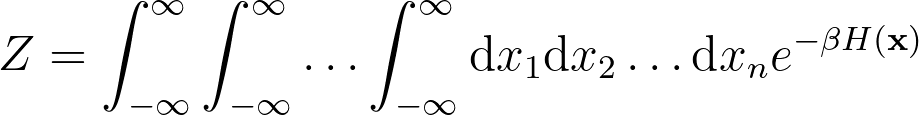
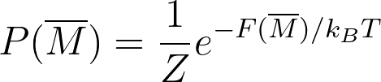
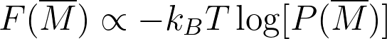
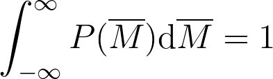
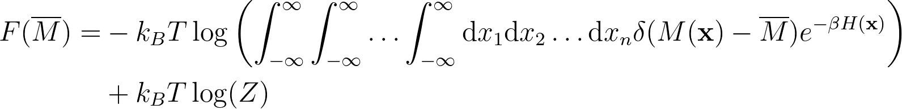

# Calculating the free energy

If we are running a simulation in the canonical ensemble the probability density that we have just calculated is an estimate for the following integral.

where:

In this expression \delta is a Dirac delta function and the integral here runs over all of phase space. It is thus a multidimensional integral over 
multiple coordinates.  It is useful to introduce an energy F(M) of the single coordinate, M, that would have given rise to the distribution above as follows:

Notice that in introducing this energy we have just used what we know about the canonical ensemble.  The F(M) that we have introduced here is a quantity known as the free energy.  
It can be estimated from the probability density that we obtained from our simulation using:

     

__Your task in this exercise is to estimate the free energy F(M) as a function of the magnetisation per spin__.  You should draw a graph with a continuous line showing the estimated free energy with the x-axis 
label "average magnetisation per spin" and y-axis label "free energy / natural units".

To estimate the free energy you should construct a histogram with `nbins` bins.  The first of these bins should start at `minx` and the last of them should end at `maxx`.  The estimate of the free energy that you get from each
of the bins in your histogram should be plotted at the midpoint of the bin.  Please note that I ran the simulation at a temperature equivalent to kT=5.0.

N.B.

When you calculate the free energy from the probability density you will need to ensure that the probablity density is normalised to pass this exercise.  In other words, your estimate of the probablity density, P(M), should satisfy:

When calculating free energies this normalisation is not strictly necessary.  Notice that if we take the first equation in these instructions and insert it in the second equation we arrive at:

In other words, the normalisation constant here (which is equal to the partition function) only appears in an additive constant.  We could thus get the free energy from the unormalised histogram.  

The fact that the normalisation doesn't matter is important.  Noting this fact reminds us that whenever we quote energies (or free energies) we need to quote them relative to some reference structure.
In other words, every time we give an energy (or free energy) of a state A we are actually giving the difference between the energy of state A and some other (reference) state B.  Your work is incomplete if 
you give an energy without specifying the state that has zero energy.
