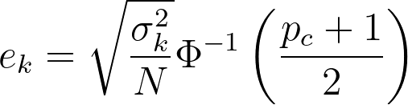
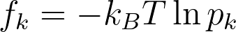
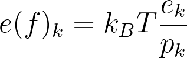
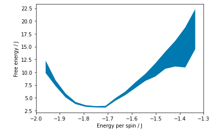

# Error bars for free energy surfaces

As you know any averages that we calculate from Monte Carlo simulations are estimates and must be reported with errors.  The same holds for these estimates
of the free energy that we have just learned to calculate.  In this exercise I am going to show you how to calculate and report these errors.

The first step in calculating the errors comes once you recognise that the fraction of counts in each of the bin in the histogram is an estimate of an ensemble 
average.  The observable we are calculating in this case is a funtion that is one when the M is between a and b and zero otherwise.  We can thus use the block averaging
technique that should be familar by now to get multiple estimates for these ensemble averages.  In other words, we split up the trajectory into N blocks.  We then calculate
N separate estimates of the histogram from these N blocks of trajectory.  The final histogram and errors upon it that we report are then determined by computing averages and 
variances from these N separate estimates.  To get the error for a p_c confidence limit from the variance we use:



where \sigma_k^2 is the estimate for the variance, N is the number of blocks and \Phi^{-1} is the inverse of the cumulative distribution function for a standard normal distribution.
This last function can be calculated using:

```python
scipy.stats.norm.ppf( (pc+1)/2 )
```

Notice that when we calculate a histogram we are calculating M ensemble averages in one shot, where M is the number of bins we have used when calculating our histogram.  At the end
of the process of calculating the histogram we will thus have M averages, which we will call p_k, and M error values, which we will call e_k.  As you know the free energy is obtained from the 
histogram using:



The error on the free energy is thus obtained as:



When I draw an estimate for a free energy surface in one of my papers I like the width of the line I draw to indicate the confidence limit on my estimate of the free energy surface.  I will 
thus use a command like this one:

```python
plt.fill_between( xv, f - e, f + e )
```  

which generates the figure shown below:



In the python fragment above the NumPy array `xv` contains the mid points of the histogram bins.  `f` is a NumPy array that contains the estimates of the free energy that were obtained using block averaing.
`e` is the error on the estimate of the free energy.  Hopefully, you can see how any line through the filled part of the curve is consistent with the results I obtained.

__Your task for this exercise is to generate a plot of the free energy surface with error bars calculated in the way described above__  You should analyse the data in the NumPy array `mags` and use blocks with size `nblocks` in your program.  
The data I have given you was collected at a temperature that corresponded to k_B T = 5 and is the same as the data you have had in the previous two exercises.  As with the previous two exercises, to estimate the free energy you should construct 
a histogram with `nbins` bins.  The first of these bins should start at `minx` and the last of them should end at `maxx`.  The estimate of the free energy that you get from each of the bins in your histogram should be plotted at the midpoint of the bin. 

The tests don't look at the graph you are generating but instead look at the values in the two arrays `lower_yv` and `upper_yv`.  These arrays must be set so that a graph similar to the one shown above is drawn with the 
shaded area representing the 90% confidence limit on your estimate of the free energy.

Notice that as in the previous exercise you need to ensure that you normalise the histograms before computing free energies to pass the tests.

=====

A final note of caution: You will find multiple bins in the histogram which will have zero visits in the trajectory. The error for these bins should also be zero but will come out as nan (not a number) as in calculating the error we need to divide by the 
fraction of time spent in the bin (which is zero). a/0 cannot be computed which is why you get nan.  

I mention this because, to pass the test, you will need to ensure that there are no nan values in the arrays `lower_yv` and `upper_yv` that are plotted.  You can get rid of these values by ensuring that you do not divide by zero.  In other words, you will need
to calculate the error for a bin differently when the estimate for the histogram in that bin is zero and when the estimate is non-zero.
