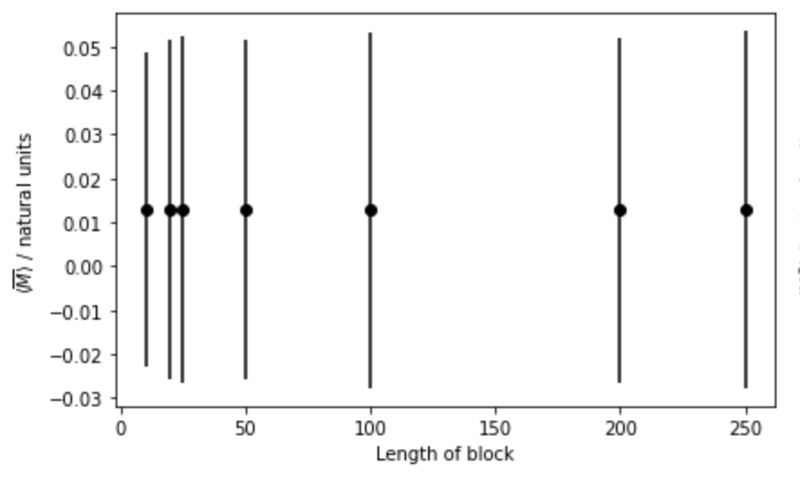
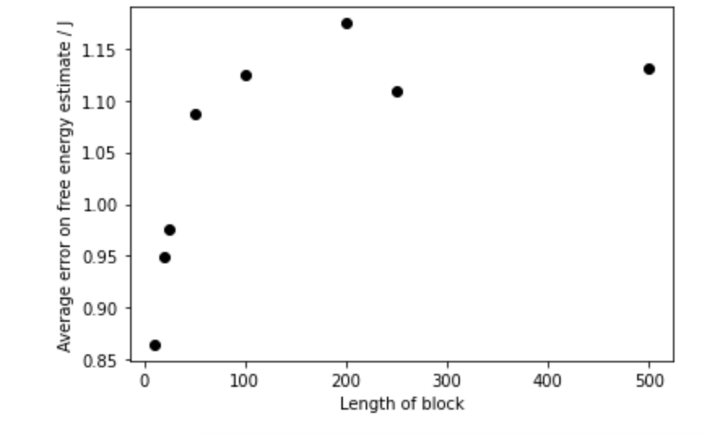

# Ensuring errors are not underestimated

Hopefully you found extending concepts of block averaging that you learned about when you were estimating ensemble averages to estimating free energy surfaces
not too difficult.  This procedure was covered in the last exercise.  There is one further concept that you learned about in the earlier exercises about block 
averaging that we need to cover here.  Once we have covered that in this exercise you can move on to the assignment.

As you hopefully remember we introduced block averaging because we were worried about correlations between random variables extracted from
trajectories.  The existence of these correlations ensures that we will underestimate the variance if we calculate it the normal way.  We thus do this 
business with blocks instead.  

When you last looked at calculating block averages you learned to draw graphs that showed how the variance changes with block size like this one:

For this exercise you need to do something similar and investigate how the size of the average error for the histogram depends on the sizes of the blocks that it is computed from.
You should calculate the block-averaged histograms for block sizes of 10, 20, 25, 100, 200, 250 and 500 along with the errors on the average histograms.  From these histograms and errors
you can caluclate the free energy and its associated error.  If you then take an average of the errors for those bins that have been visted more than 0 times you can get a measure of the average
error on the estimate of the free energy for each block size.  You will thus be able to produce a graph something like the one shown below:

It is this graph that is tested at the end of the exercise.  As always you need to use the data in the NumPy array called `mags` to produce your graph.  This array contains data from a Monte Carlo
trajectory that was run at a tmperature equivalane to kT=5.  

You should construct a histogram with `nbins` bins.  The first of these bins should start at `minx` and the last of them should end at `maxx`.  Your graph should have estimates of the average for block sizes of 
10, 20, 25, 100, 200, 250 and 500. The x-axis label should be "Length of block" the y axis label should be "Average error on free energy".  
