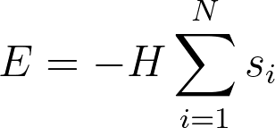

# Hamiltonian for non-interacting spins

In order to do Monte Carlo we are going to need a Hamiltonian to calculate the energy of the microstates.
In these next three exercies we are thus going to write functions that describe Hamiltonians that become 
progressively more and more complicated.  

The first simple Hamiltonian that you are going to write gives the energy as:

Where H is the magnetic field strength, the sum runs over the N spins in the system and s_i is the spin of the 
ith particle.  You will notice that this is the Hamiltonian for a set of non-interacting spins that you studied 
for the first of the assignments in this module.  If the spins are not interacting, the way they are 
arranged is not particularly important so the 2D model of the spins is equivalent to the 1D model we have studied before.

To complete this exercise you need to write a function called `hamiltonian` that returns the energy calculated using 
as a formula.  This function takes two arguments:

* `spins` is a 2D NumPy array that contains the microscopic coordinates of all the spins.
* `H` is the magnetic field strength.
