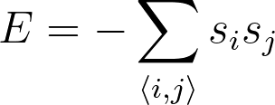

# Hamiltonian for interacting spins

Having revised the Hamiltonian for a set of non-interacting spins lets get on to something more interesting and 
write a function that calculate a Hamiltonian that describes the interaction between spins.  We are going to use the following
Hamiltonian here:

Here the sum runs over all pairs of spins that are adjacent in this lattice and s_i and s_j are spins coordinates.  The following diagram does a better job of describing how the spins in 
our system interaact that the equation.  

You can see that each spin indicates with its four nearest neighour.  So the blue spin in the center of the diagram below interacts 
with the four spins that are shown in red.  You can implement this Hamiltonian by doing a sum over all the spins in the lattice.  Each spin
should be multiplied by the spins of the four atoms that are adjacent to it in the lattice.  The whole sum then needs be divided by two to account
for the double counting.

To complete this exercise you need to write a function called `hamiltonian` that returns the energy calculated using  
the formula above.  This function takes a single argument called `spins`.  This argument is a 2D NumPy array that contains the microscopic coordinates of all the spins.
