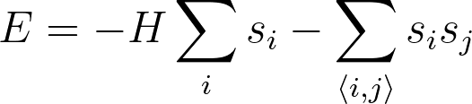

# The full Hamiltonian

Lets now combine what we learned in the last two exercises and implement the full Hamiltonian for the 2D Ising model that is given by the equation below:

This is the combination of the interaction with the spins with the magnetic field with strength H and the interactions between the pairs of adjacent spins that we saw in the 
previous exercise.

So as with the two previous exercicses, to complete this exercise you need to write a function called `hamiltonian` that returns the energy calculated using 
the formula above.  This function takes two arguments:

* `spins` is a 2D NumPy array that contains the microscopic coordinates of all the spins.
* `H` is the magnetic field strength.

