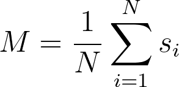

# Calculating the magnetisation

The average magnetisation per spin for a particular configuration is calculated as:

where the sum runs over all of the `N` spins in the lattice and the s_i values are the spin coordinates.  Your task for this exercise is to complete 
the function called `magnetisation` and to write a function that takes a 2D NumPy array, `spins`, that contains the spin coordinate for a 
microstate of the system and that returns the magnetisation calculated using the formula above.
