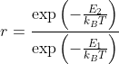

# Running Monte Carlo

The next few exercises are going to explain how to write a Monte Carlo code for simulating the Ising model.  However, in the exercise I am 
going to cover the basic ideas of Monte Carlo by getting you to write a program to sample one of the 1D energy landscapes that you investigated
using MD last week.  With that in mind, I have written a function called Hamiltonian in `main.py`.  This function takes the position of the particle
and returns the energy.  As you can see the energy in this case is just a harmonic potential.

You are going to write code that generates a graph that shows the series of x values that are sampled by the Monte Carlo trajectory.  I will then test that you 
have implemented Monte Carlo correctly by determining if the series of random variables is sampling from the correct distribution.  I have started the process 
of writing this code for you by setting the inital position of the particle equal in the variable `pos`.  You will also see that I have set the variable `oldenergy`
equal to the energy that the system has when the particle is at `pos`.

I have then written a loop that will generate `nsamples` random variables using Monte Carlo and created NumPy arrays called `xvals` and `yvals` that will be plotted
using Matplotlib.  __Your task is to fill in the code in this loop so that the array yval contains the frames that are generated by your Monte Carlo simulation.__

The steps that need to be completed in the loop (and which you must code) are as follows:

1. You need to generate a new particle position `newpos`.  To generate this new position you a uniform continuous random variable, `U`, that is between -`maxshift` and +`maxshift and add it to `pos`.  You thus generate a new position by moving `pos` either left or right by a small (random) ammount.

2. You calculate the energy at the new position `newpos` by calling the function `hamiltonian`.  Save this new energy to a variable called `newenergy`

3. If `newenergy` is less or equal to `oldenergy` then you __accept__ the move.  You thus set `pos=newpos` and `oldenergy=newenergy`

4. If `newenergy` is greater than `oldenergy` then you calculate the following ratio:

where E_2 is `newenergy` and E_1 is `oldenergy` and T is the temperature. The variable `temp` contains the value of k_B T that I will assume you 
have used in your code when I test it.

5. You then generate a second uniform random variable between 0 and 1, `Ua`, if `Ua` is less than the ratio you calculated in step 4 (r) then you accept the move and set `pos=newpos` and `oldenergy=newenergy`.  If it is greater then the move is rejected and no changes are made to the values of `pos` or `oldenergy`.

This 5 step process will then be repeated multiple times because it is in a loop.  The graph that is plotted will thus show the position the particle took in the accepted moves.  Whenever a move is not accepted you will see two consecutive points that have the same y-value. 

   
