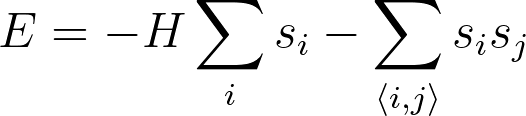
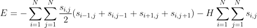
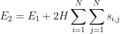
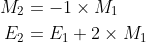
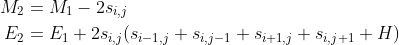

# Writing a fast Monte Carlo code for the Ising model

You are now in a position to write a Monte Carlo for the 2D Ising model by combining what you have learned about evaluating the Ising model Hamiltonian 
and what you learned in the previous exercise about how Monte Carlo codes work.  In this code you will:

1. Pick an initial state for the 2D Ising model by generating a 2D NumPy array filled elements that are either -1 or 1.  You will then evaluate the energy of that initial state by using what you learned about the Ising model Hamiltonian.

2. You then write a loop to do the Monte Carlo sampling.  Each time you pass through the loop you generate a trial move by either (a) flipping one spin or (b) flipping all the spins.

3. You then evaluate the energy of the new state that was generated by the trial move and use the accept criteria described in the last exercise to decide if the trial move should be accepted or rejected.

The naive way of implementing the Monte Carlo code is to call the function to evaluate the full Hamiltonian each timme you generate a trial move in step 2.  This method of implementing the exercise is not very sensible
as it is computationally expensive.  However, this computational expense can be avoided with a little careful though about the Hamiltonian and our trial moves.  Remember that the Hamiltonian for the 2D Ising model is:



It is useful to express this energy as:



where the double sum ensures we run over all the lattice sites.  Notice that if all the spins are flipped the term in the above sum that describes the interaction does not change as the relative orientations of all pairs of spins 
in the system does not change.  The only thing that changes is the interaction with the magnetic field which changes sign.  If all the spins are flipped we can calculate the energy of the new state as follows:



where E_1 is the energy of the old state.  Notice, furthermore, that when you sum over all the spins you get the magnetiation, M.  We can thus obtain the new magnetisation, M_2, and the new energy, E_2, from the old magnetisation, M_1, and old energy, E_1 as follows:



Similar tricks can be used to calculate the new energy and magnetisation when the spin on lattice site (i,j) reverses direction as follows:



By using these tricks you avoid the computational expense associated with recalculating the full Hamiltonian every time you generate a trial move.

__Your task in this exercise is to implement these tricks yourself and to revise the process of calculating the full Hamiltonian__  You must complete the following two functions:

1. `hamiltonian` takes in two arguments `spins` and `H`.  `spins` is a 2D NumPy array that contains the coordinates of all the spins and `H` is the magnetic field strength.  Your function should evaluate and return the energy of the configuration that is passed using the first equation on this slide.  _This exercise should be revision as you did it as part of an earlier task_.

2. `new_energy` takes in four arguments `spins`, `E`, `H` and `move`.  `spins` is a 2D NumPy array that contains the coordinates of N^2 Ising spins and `E` is the energy of the configuration in `spins`.  `H` is the magnetic field strength.  `move` is an integer that is greater than or equal to 0 and less than N^2 + 1.  If this integer is equal to N^2 your function should return the energy of a configuration in which all the spins point in the opposite direction to the one they point in `spins`.  For all other values of `move` you should determine a single spin to flip using the following piece of python code:

```python
# You will flip the coordinate with spins[i,j] with i and j calculated as follows
N = spins.shape[1]
i, j = int( np.floor( move / N ) ), move%N
```   

You should return the energy of the configuration that has this particular spin flipped.

Please use the tricks that I have described above to make your `new_energy` function fast.  You code will fail if you call `hamiltonian` from the function `new_energy`
