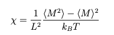
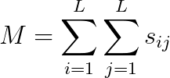

# Estimating the magnetic susceptibility

By completing the last exercise you demonstrate that you can sample states using the Metropolis Monte Carlo algorithm. 
To analyse the sequence of sampled states that this algorithm generates you can use the same tools that you used in the previous exercise 
to analyse molecular dynamics trajectories.  In other words, when you take averages over observables for the sampled states you get estimates 
of ensemble averages.  You can also use block averaging to obtain estimates of the error on these estimates.  In doing all this, however, you need
to take care that you have equilibrated the system before you start collecting statistics.

__In this exercise I want you to estimate a thermodynamic quantity by performing a Monte Carlo simulation__.  The quantity I want you to estimate is the 
susceptibility per atom:

In this expression <M> is the ensemble average of the magnetisation:

 

where s_ij is the spin on site i,j and the sum runs over all the L^2 lattice sites.  <M^2> is the average of the squares of magnetisation.  

I have written an outline code in `main.py`.  As in the last exercise I have written a function called `monte_carlo` that takes the following 7 input arguments:

* `N` - the number of production steps of Monte Carlo to perform.  Statistics are accumulated during the production phase of the run.

* `equil` - the number of equilibration steps that should be performed before starting the production phase of the simulation.  All the states that are visited during this equilibration phase are discarded.  They are not used when accumulating averages.

* `stride` - the frequency that should be used for collecting statistics during the production phase of the calculation.  Averages are only updated every `stride` steps.  States visted on steps that are not a multiple of stride are discarded and not used when accumulating averages.

* `L` - the size of the sysstem.  An LxL array of spins in simulated.

* `H` - the magnetic field strength

* `T` - the temperature

* `seed` - the random number seed 

This function should return one scalar - your estimate for the suceptibility that is computed using the formula above.  To complete the code you will need to complete the following tasks:

1.  Write code to calculate the energy and magnetisation of the initial configuration.  The initial configuration is set up in the NumPy array called `spins`.  To calculate the energy of this configuration you will need to use what you learned in the exercises on evaluating these spin hamiltonians.  The energy should be stored in a variable called `eng`.  You have also learned how to calculate the magnetisation in previous exercises.

2. Write code to calculate the energy of the new state that is generated by the trial move.  You will notice that I generate a random integer `move`.  This variable determines the random move that should be performed.  If `move` is equal to `L*L` then the trial move involves flipping every spin.  If `move` is equal to any other value then the `spin[j,k]` is flipped.  You should set the variable `neweng` equal to the energy of the new configuration.  To complete this task you will need to use what you learned in the exercise that came just before the previous one. 
           
3. You need to decide whether or not to accept the trial move.  You need to complete the if statement that contains a call to the `min` function.  To complete this line of the code you will need to use what you learned in the first exercise on Monte Carlo that you completed.  The exercise where you used Monte Carlo to sample a harmonic potential.

4. You need to update the `spins` array so that it contains the trial move when the trial move is accepted. If this updating of `spins` is not performed then we cannot determine the energy of the trial move when we start the new move on the next pass through the loop.  At this point you also need to determine the new value of the magnetisation.  Please note that you can quickly update the magnetisation from the old magnetisation in much the same way as you have learned to quickly recompute the energy.  You do not (and should not) sum all the elements of the `spins` array on every step

5. You need to add code to accumulate the ensemble averages <M> and <M^2>.  I would use the variables `M` and `M2` to hold the numerators of these ensemble averages and `ns` to hold the denominator.  Please note that to pass the test you should only 
modify these varaibles after the first `equil` steps of Monte Carlo have been completed.  Furthermore, even when those first `equil` steps have been complted you should only be updating `M`, `M2` and `ns` every `stride` steps.

6. At the end of the run you should calculate the suscetibility using the formula above and return this value.

Once you have completed those four bits of code and the code is run the values of the suscebility for two distinct two temperatures will be output. 
           

