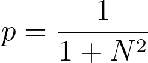

# Flipping a randomly selected spin

The Monte Carlo algorithm that we are going to implement works by making random moves to new microstates of the system. In this exercise we are thus 
going to write code to generate a new microtates.  

To complete this exercise you need to write four functions.  

The first of these functions is called `flipSpin` and takes three arguments.  The first of these arguments `spins` is a 2D 
NumPy array that contains the current microstate.  The second and third arguments `i` and `j` are then the indices of the indices for the spin
coordinate that should be flipped.  The first of these indices is the first index of the coordinate that should be flipped and the second is the second.
This function should return a NumPy array that contains the microstate with the flipped coordinate.

The second of these functions is called `flipAllSpins`.  This function takes a single argument called `spins`, which is a 2D
NumPy array that contains the current microstate.  The function should return a new microstate in which every spin has flipped direction.

The third of these function is called `chooseMove`.  This function randomly selects what type of move to perform.  It takes a single argument, `spins`, in input, which 
is a 2D NumPy array that contains the current microstate.  This function should return a Bernoulli random variable with:

Where N^2 is the number of spins in the lattice.   If this random variable is one it tells your Monte Carlo to generate a new structure by flipping all the spins.  

The final function you need to write is called `chooseSpin`.  This function chooses a spin to flip.  It again takes a single argument, called `spins`, in input, which 
is a 2D NumPy array that contains the current microstate.  It should return two numbers that specify a particular spin to flip.

N.B. When you come to writing your Monte Carlo code you will combine all these functions into a single function for generating moves. Your code will:

1. Use functionality like that in `chooseMove` to generate a Bernoulli random variable X that determines whether you flip a single spin or all the spins.

2. If X=1 then you call `flipAllSpins` to flip all the spins and you are done.  

4. If X=0 then you call `chooseSpin` to select the spin to flip and then pass the set of coordinates output to `flipSpin` to generate the new microstate.

I have only asked you to write these functiosn separately here so that I can more easily write tests to ensure that all the parts of your implementation are correct.
