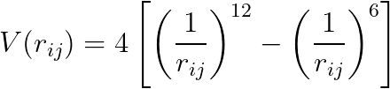

# Setting up the calculator

In completing the previous exercise you learned how to setup the initial structure.  You are thus half way towards 
running an MD simulation.  The other half that you need to learn is how to create code to calculate the energy of the system
and the forces on the individual atoms.  Once you have code to calculate the forces ASE can use the Verlet algorithm that you 
learned for second of these assignments to propegate the initial positions and velocities with time.

In ASE the forces are calculated by a calculator method that is attached to the atoms object that you learned to create in the previous
exericse.  Code to attach this method to the atoms object and then run NVT molecular dynamics would look something like this:

```python
import pairwise_calc

# Insert code from last exercise to create an atoms object and set masses and velocities here.

# Attach the method that should be used to calculate energies and forces to the atoms object
atoms.calc = pairwise_calculator( rc=4, pairwise_e=fff )

# And run 1000 steps of Langevin dynamics on the particles. We are running Langevin dynamics
# with k_B T = 2, a timestep of 0.005 and a thermostat friction of 1.0 here.
dyn = Langevin( atoms, 0.005, 2.0, 1.0 )
dyn.run(1000)
```

The calculator method that we are using in this input is one that I have written for you (there are many others that 
form part of of the ASE package).  You can look at the code for this calculator by opening the file `pairwise_calc.py`.
When you come to do the assignments you will also need to copy the contents of this file to your python notebooks in order
to use the functionality within it.

The `pairwise_calc.py` calculator that I have written for you allows you to write a function to calulate the pair potential
that acts between the atoms.  This function is then passed to ASE and used in the `pairwise_calculator` object.  In your projects 
you should use the potential that you studied in the exercise on MD as a pair 
potential.  In other words, the energy for a pair of atoms separated by a distance r should be f(r) where f is the potential
that you used in that previous MD assignment. 

__To complete this repl exercise you need to complete the code in `main.py` so that it can be used to run molecular dynamics for a 
system of Lennard Jones particles.__  The energy of a pair of atoms that are separated by a distance r_ij and that interact through 
the Lennard Jones potential is given by:



This quantity should be calculated and returned by the function called `fff` that you must complete.  This function should also 
return a second quantity, which is the value of f_ij such that:


In this expression the derivative of V the left hand side is the derivative of the pair potential with respect the x position of atom i
and x_ij is the x-component of the vector that connects atom i to atom j.  Notice that the r that enters the expression for the Lennard Jones pontential
is given by:


and that when you calculate the forces on the atoms you have to differentiate with respect to the atomic positions and not the distance between
the atoms.  Doing this differentiation involves using the chain rule.

The fact that the function `fff` is to be used to calculate the pairwise energies is passed to the `pairwise_calculator` method by setting the 
argument `pairwise_e` equal to `fff`. The other argument to the function `rc` is a cutoff that tells ASE that the potential should be assumed 
to be zero when atoms are separated by a distance that is greater than `rc`.  To pass this exercise `rc` must be set to 4.  However, you may find this 
cutoff needs to be set to a larger (or smaller) value when you study your potential

__Notice that you will also need to copy the code for setting the masses, initial positions and initial velocities that you wrote in the last exercise to `main.py` to complete the exercise.__
The initial positions, number of atoms and temperature should be set as they were in that previous exercise.
