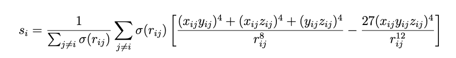
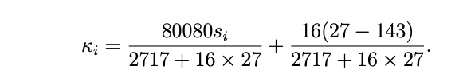

# Calculating the FCC cubic parameter

The radial distribution provides indirect information on whether the average structure of the material resembles an ordered solid or a more disordered liquid.
Another way to make this distinction is to use an order parameter or symmetry function.  If you are modelling a system of N atoms you can caluclate N instances
of the order parameter as you calculate one order parameter for each atom in the system.  The order parameter is computed from the vectors that connect the central
atom to each of the atoms in its first coordination sphere.  Often times order parameters are designed to be one when the environment about the atom resembles the 
environment in an ideal, crystalline solid and zero if it does not.

In this exercise you are going to learn to calculate an order parameter that can be used to detect whether the environment around an atom resmebles the environment in 
an ideal fcc crystal.  The functional form of this order parameter is as follows:



The sums in this expression run over all the atoms in the syste.  $r_{ij}$ is the distance between atom $i$ and atom $j$ and $x_{ij}, $y_{ij}$ and $z_{ij}$ are the $x$, $y$ and $z$ components 
of the vector that connects atom $i$ to atom $j$.  $\sigma(r_{ij})$ is a switching function that is 1 if $r_{ij}<1.5$ and 0 otherwise.  When this function is used to identify 
regions where the structure resembles the fcc crystal it is useally tranformed using the following expression:



__Your task in this exercise is to write a function called `fcc_cubic` that calculates this order parameter.__ Your function should take an Atoms object called atoms from 
ASE as input.  It should calculate the function above for __all__ N atoms in this input object and store this information in a NumPy array with N elements.  Your function
should then return this NumPy array.

In the file `main.py` I have included some code to get you started.  The code that I have written used ASE to generate a 2D NumPy array called `distances` that contains the 
pairwise distances between all pairs of particles in the syste.  I have also used ASE to generate a 3D NumPy array called `vecs` that contains the x, y and z components of all the 
vectors connecting distinct pairs of atoms.  To get the x, y and z components of the vector connecting atom i to atom j from this array you would use code like this:

```python
x, y, z = vecs[i,j,0], vecs[i,j,1], vecs[i,j,2]
``` 

I have also setup NumPy array called `order_p` that you can use to hold the values of all the order parameters that you will calculate.


