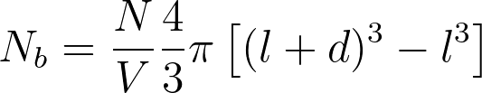

# Calculating the radial distribution function

In the previous exercise you learned how you can use `dyn.attach` to access the positions of the atoms.  In the remaining readings for this assignment you 
are going to learn two methods for analysing the trajectories that ASE generates.  You can perform these analysis methods 
by attaching a function to do the ananlysis on the fly using `dyn.attach`.  Alternatively, you can use the approach that I am using here, where you save the trajectory 
and then analyse it in postprocessing.  I am doing postprocessing here because it is easier for me to test your code.  

In this exercise you are going to learn to calculate the radial distribution.  This function describes how the density varies as a function of the distance from a refernece
particle.  It is a measure of the probability of finding a particle at a distnace of r away from a given reference reference particles, relative to that probability in the ideal
gas.  

To calculate the radial distirbution function you need to adapt the code that you have previously learned to write to estimate the histogram.  The first step in calculating this function
is to divide the interval between 0 and some maximum distance `maxd` into `nbins` discrete bins.  Each of the distances in each of the frames of the trajectory are then assigned to the appropriate
bin just as you have learned to ascribe other observables to bins in a histogram.

There is a crucial difference between the process of calculating a histogram that you have gone through in previous exercises and the process of calculating a radial distribution function.  When you 
have calculated histograms in previous exercises there has been exactly one sample to add to the histogram for each frame of your trajectory.  __When you calculate a radial distribution function from a
trajectory of N atoms each frame gives you N(N-1) samples of the random variable__ as there are N(N-1) distances between your N particles.  The radial distribution function should, therefore, converge
relatively quickly as you can quickly generate a lot of data to estimate it from.

Having said all that, you will hopefully find the process of calculating the (unormalised) rdf rather easy as the code that I am asking you to write here is very similar to the code for writing a histogram
that you have written many times before.  To help you get started I have written the following piece of code in `main.py`:

```python
# Do a loop over all the trajectory frames
for atoms in Trajectory('trajectory.traj') :
    # Calculate the distances between all pairs of atoms
    distances = atoms.get_all_distances( mic=True )
    # Do a double loop over all the distances 
    for i in range(1,distances.shape[0]) :
        for j in range(0,i) : 
            if  distances[i,j]>maxd : continue 
            # You need to add code to accumulate the histogram here
```

The first loop in this code iterates over all the trajectory frames.  I then use the `atoms.get_all_distances` from ASE to calculate the distances between all the particles in the system.  This method returns
an NxN NumPy array in which element i,j gives the distance between atom i and atom j.  The two inner loops in the code above iterate over the lower triangle of this (symmetric) matrix.  You need to add code 
to accumulate the histogram from the various `distance[i,j]` values that are iterated over.  Think carefully about the fact that the loop will iterate over only N(N-1)/2 of the distance elements of the matrix
`distances`. 

Once you have accumulated your histogram you need to normalise it.  When normalising the rdf you need to divide by:

1. The number of frames in the trajectory.  
2. The number of atoms in the system.
3. The number of atoms that you would expect to find in an ideal gas that has the same volume and density as the bin.

The third of these quantities is given by the following expression:



In this expression `l` indicates the value at which the bin starts, `d` is the width of the bins `N` is the total number of atoms and `V` is the volume of the box.  This expression is just the difference 
in volume between a sphere with radius `l+d` and a sphere with radius `l` multiplied by the density of the medium.  You can get the volume of the box from the ASE atoms object by using the command `V=atoms.get_volume()`

To pass the assignment you need to generate a plot of the radial distribution function that you have calculated from the trajectory.  Your radial distribution function should be calculated up to a maximum distance of `maxd` and 
should have `nbins` bins.  The value of the radial distribution in the ith bin should be plotted at the midpoint of the bin.  The x-axis label for your plot should be "r / sigma" and the y-axis label should be "g(r)".
